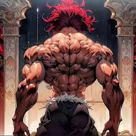
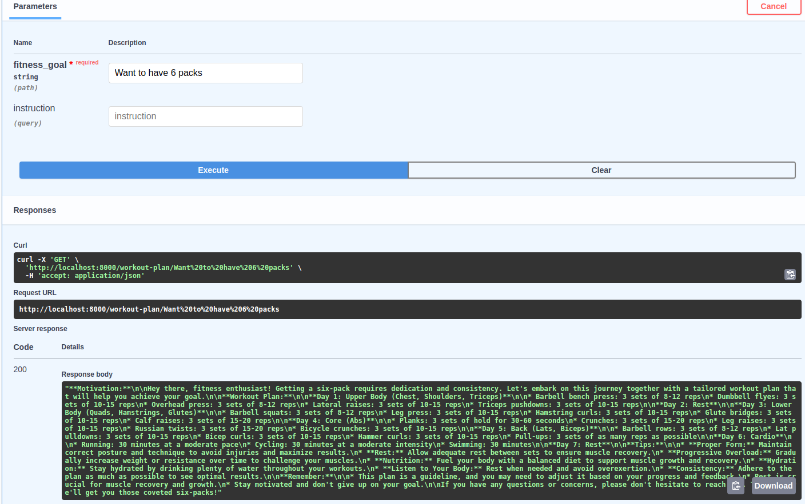

# B2M - Build My Muscle 🦾

Create an agent to make your health plan better!



## 🤓 Introduction
Hey fitness enthusiasts 👋 Get ready to revolutionize your fitness journey with our game-changing project that leverages the power of Large Language Models (LLMs). Our cutting-edge technology acts as your personalized fitness companion, offering tailored workout plans, nutritious meal suggestions, and expert advice on supplements, all designed to help you achieve your fitness goals effortlessly and effectively. 

We aim to provide you 📝: 

+ **Personalized Workout Plans**: Receive tailored workout recommendations based on your fitness level, goals, and preferences. Our LLM analyzes your input and generates a customized plan that optimizes your training.

+ **Healthy Meal Suggestions**: Discover a wide range of nutritious meal options that cater to your dietary needs and preferences. Our LLM provides detailed recipes and meal plans to support your fitness journey.

+ **Expert Supplement Advice**: Get informed recommendations on supplements that can enhance your workout performance and recovery. Our LLM analyzes your individual needs and suggests the most effective supplements to complement your fitness routine.

## 💬 Usage 

To run the project locally, the following conditions must be met, cloning the project and install requirements: 

```
    git clone https://github.com/MinLee0210/B2M-BuildMyMusle.git
    pip install -r requirements.txt

```

Then, you create an `.env` file in the `app` directory and store the `GEMINI_API_KEY` after you get the API key on [Google AI Studio](https://ai.google.dev/). 

The project is ready to go by hitting these lines of code: 

```
    cd /app
    python main.py
```

## 🛤 Roadmap

To be honest, this is the prototype. The project is still on the go. However, we are planning to: 

+ 👉 Hosting the API so that everyone can use it freely. 
+ 👉 Personalizing plans for each user (RAG, etc.).  
+ 👉 Changing our environment; from LangChain to Llama. 
+ 👉 Documenting the project.


## Gallery

1. Asking the agent to plan a workout plan so that I can achieve a 6 packs. 




## 📫 How to reach me:
+ Gmail: minh.leduc.0210@gmail.com
+ Linkedin: https://www.linkedin.com/in/minh-le-duc-a62863172/
+ Medium: https://medium.com/@octoopt_8888


